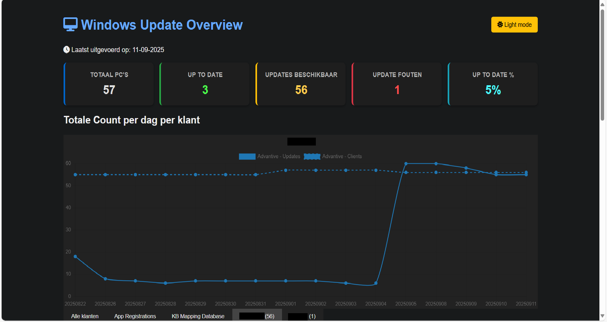

# Windows Update Report MultiTenant

| Repository Status | Windows Update Report |
| :--- | :--- |
|  [![last commit time][github-last-commit]][github-master] [![GitHub Activity][commits-shield]][commits] | |
| [![License][license-shield]](LICENSE) [![Forks][forks-shield]][forks-url] [![Stargazers][stars-shield]][stars-url] [![Issues][issues-shield]][issues-url] | [![Contributors][contributors-shield]][contributors-url] [](https://GitHub.com/scns/Windows-Update-Report-MultiTenant/releases)



Dit PowerShell-project genereert een overzichtsrapport van ontbrekende Windows-updates per device voor meerdere tenants via Microsoft Graph. Het resultaat is een dynamisch HTML-dashboard met filterbare tabellen en grafieken.

## Functionaliteit

- **Automatische module installatie**: Controleert en installeert automatisch benodigde PowerShell modules
- **Configureerbare instellingen**: Alle instellingen beheerbaar via `config.json`
- **Multi-tenant ondersteuning**: Haalt per tenant de ontbrekende Windows-updates op via Microsoft Graph Threat Hunting API
- **Flexibele export opties**: Exporteert resultaten naar CSV-bestanden per klant
- **Interactief HTML-dashboard**: Genereert een dashboard met filterbare tabellen (DataTables) en grafieken (Chart.js)
- **Intelligente bestandsbeheer**: Automatische archivering van oude export bestanden
- **Automatische browser integratie**: Opent het gegenereerde rapport automatisch in de standaard webbrowser

## Benodigdheden

- PowerShell 5+
- Microsoft Graph PowerShell SDK (wordt automatisch geïnstalleerd)
- Een Azure AD App Registration per tenant met de juiste permissies

## Voorbereiding

### 1. Maak een Azure AD App Registration aan

1. Ga naar [Azure Portal - App registrations](https://portal.azure.com/#blade/Microsoft_AAD_IAM/ActiveDirectoryMenuBlade/RegisteredApps).
2. Klik op **New registration** en geef de app een naam.
3. Na het aanmaken, ga naar **API permissions**.
4. **Verwijder alle standaard toegevoegde permissies** (zoals `User.Read`).
5. Voeg de volgende Microsoft Graph **Application** permissies toe:
    - `SecurityEvents.Read.All`
    - `ThreatHunting.Read.All`
6. Klik op **Grant admin consent** voor deze permissies.
7. Ga naar **Certificates & secrets** en maak een nieuwe client secret aan. Noteer deze waarde direct.

### 2. Configureer het project

#### Credentials bestand

Maak een bestand `credentials.json` aan in de root van dit project met het volgende format:

```json
{
  "LoginCredentials": [
    {
      "ClientID": "xxxxxxxx-xxxx-xxxx-xxxx-xxxxxxxxxxxx",
      "Secret": "YOUR-CLIENT-SECRET",
      "TenantID": "xxxxxxxx-xxxx-xxxx-xxxx-xxxxxxxxxxxx",
      "customername": "KlantNaam"
    }
    // Voeg meer tenants toe indien nodig
  ]
}
```

#### Configuratie bestand

Het script gebruikt een `config.json` bestand voor alle instellingen:

```json
{
    "exportRetentionCount": 10,
    "cleanupOldExports": true,
    "exportDirectory": "exports",
    "archiveDirectory": "archive"
}
```

**Configuratie opties:**

- `exportRetentionCount`: Aantal export bestanden dat behouden blijft per klant/type (oudere worden gearchiveerd)
- `cleanupOldExports`: Schakel automatische archivering in/uit (true/false)
- `exportDirectory`: Directory waar nieuwe export bestanden worden opgeslagen
- `archiveDirectory`: Directory waar oude export bestanden worden gearchiveerd

> 📖 **Gedetailleerde configuratie uitleg**: Voor uitgebreide informatie over elke configuratie optie, zie [CONFIG-UITLEG.md](CONFIG-UITLEG.md)

### 3. Installeer benodigde PowerShell-modules

De benodigde modules worden automatisch geïnstalleerd bij het eerste gebruik van het script. Handmatige installatie is niet meer nodig.

## Gebruik

1. Plaats je `credentials.json` en `config.json` in de projectmap.
1. Start het script:

```powershell
.\get-windows-update-report.ps1
```

1. Het script zal:
   - Automatisch benodigde modules installeren (indien nodig)
   - Data ophalen van alle geconfigureerde tenants
   - CSV-bestanden genereren per klant
   - Oude bestanden archiveren (indien geconfigureerd)
   - Een HTML-dashboard genereren
   - Het rapport automatisch openen in je standaard webbrowser

1. De resultaten vind je in de geconfigureerde export directory, inclusief het HTML-dashboard.

## Bestandsstructuur

Na uitvoering krijg je de volgende structuur:

```text
Windows-Update-Report-MultiTenant/
├── credentials.json
├── config.json
├── get-windows-update-report.ps1
├── exports/
│   ├── 20250805_KlantA_Windows_Update_report_Overview.csv
│   ├── 20250805_KlantA_Windows_Update_report_ByUpdate.csv
│   ├── 20250805_KlantB_Windows_Update_report_Overview.csv
│   ├── 20250805_KlantB_Windows_Update_report_ByUpdate.csv
│   └── Windows_Update_Overview.html
└── archive/
    ├── 20250804_KlantA_Windows_Update_report_Overview.csv
    └── ... (oudere bestanden)
```

## Nieuwe functies in v2.0

- **Automatische module installatie**: Geen handmatige module installatie meer nodig
- **Configureerbare archivering**: Oude bestanden worden verplaatst naar archief in plaats van verwijderd
- **Flexibele directory instellingen**: Configureerbare export en archief directories
- **Automatische browser integratie**: HTML rapport wordt automatisch geopend
- **Verbeterde feedback**: Kleurgecodeerde status berichten tijdens uitvoering
- **Intelligente bestandsbeheer**: Configureerbaar aantal bestanden dat behouden blijft

## Opmerkingen

- Zorg dat je app registration alleen de genoemde permissies bevat.
- Het script werkt alleen met tenants waar de app registration en rechten correct zijn ingesteld.
- Voor meer informatie over App Registrations, zie de [Microsoft Docs](https://learn.microsoft.com/en-us/azure/active-directory/develop/quickstart-register-app).

---

© 2025 by Maarten Schmeitz

[commits-shield]: https://img.shields.io/github/commit-activity/m/scns/Windows-Update-Report-MultiTenant.svg
[commits]: https://github.com/scns/Windows-Update-Report-MultiTenant/commits/main
[github-last-commit]: https://img.shields.io/github/last-commit/scns/Windows-Update-Report-MultiTenant.svg?style=plasticr
[github-master]: https://github.com/scns/Windows-Update-Report-MultiTenant/commits/main
[license-shield]: https://img.shields.io/github/license/scns/Windows-Update-Report-MultiTenant.svg
[contributors-url]: https://github.com/scns/Windows-Update-Report-MultiTenant/graphs/contributors
[contributors-shield]: https://img.shields.io/github/contributors/scns/Windows-Update-Report-MultiTenant.svg
[forks-shield]: https://img.shields.io/github/forks/scns/Windows-Update-Report-MultiTenant.svg
[forks-url]: https://github.com/scns/Windows-Update-Report-MultiTenant/network/members
[stars-shield]: https://img.shields.io/github/stars/scns/Windows-Update-Report-MultiTenant.svg
[stars-url]: https://github.com/scns/Windows-Update-Report-MultiTenant/stargazers
[issues-shield]: https://img.shields.io/github/issues/scns/Windows-Update-Report-MultiTenant.svg
[issues-url]: https://github.com/scns/Windows-Update-Report-MultiTenant/issues